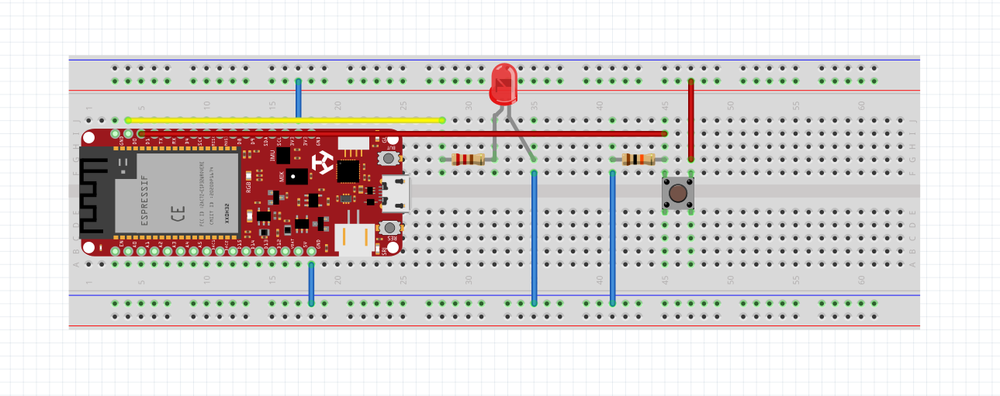

# Deneyap Kart ile Buton Kontrollü LED Devresi 💡

Bu proje, Deneyap Kart kullanılarak temel dijital giriş/çıkış (I/O) işlemlerinin mantığını kavramak amacıyla geliştirilmiş gömülü sistem uygulamasıdır. 

## 🎯 Projenin Amacı
Sistemin temel amacı; fiziksel bir butona basıldığında devreyi tamamlayarak LED'i yakmak, buton bırakıldığında ise devreyi keserek LED'i söndürmektir.

## ⚙️ Çalışma Mantığı
Sistem, Deneyap Kart'ın dijital pinleri üzerinden durum okuma ve güç yönlendirme prensibiyle çalışır:
* **Giriş (Input):** Dijital pin (`D1`) üzerinden butonun anlık durumu (`HIGH` veya `LOW`) okunur.
* **Çıkış (Output):** Eğer buton basılıysa (`HIGH` sinyali), çıkış pini (`D0`) üzerinden LED'e güç gönderilir ve LED yanar. Buton bırakıldığında (`LOW`), güç kesilir ve LED söner.

## 🛠️ Donanım Bileşenleri
* 1x Deneyap Kart
* 1x Kırmızı LED
* 1x Push-Button
* 1x 220 Ohm Direnç (LED için akım koruyucu)
* 1x 10k Ohm Direnç (Pull-down direnci)
* 1x Breadboard ve Jumper Kablolar

## 📸 Proje Görseli

## 💻 Kurulum ve Kullanım
1. Devreyi yukarıdaki donanım bileşenleri ve mantığa uygun olarak breadboard üzerinde kurun.
2. Deneyap Kart'ınızı bilgisayarınıza bağlayın.
3. Bu repodaki kod dosyasını Arduino IDE (veya tercih ettiğiniz derleyici) ile açın.
4. Kodu derleyip kartınıza yükleyin.
